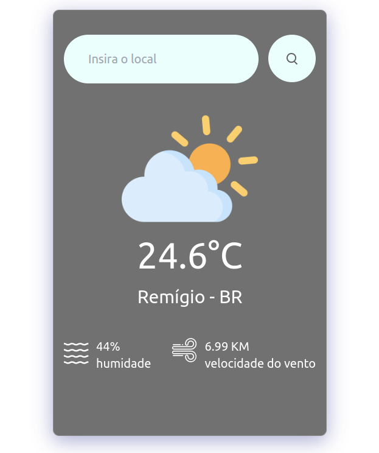

<h1 align='center'>
    
    <p>Saiba a previsão para o lugar onde você quer viajar</p>
    <video autoplay loop muted playsinline>
  <source src="./src/assets/video.mp4" type="video/mp4">
  Seu navegador não suporta a reprodução de vídeos.
</video>
</h1>

## 📕 Sobre

O **The Prevision** foi desenvolvido para que eu conseguisse entender como utilizar o **useRef** - para evitar a re-render de um ou mais inputs de formulários e ter com isso um melhor desempenho, **custom hooks** - utilizado para separar o que é código puramente javascript do que é JSX e com isso melhorar a organização do código e também a utilizar o **axios** no requerimento de API.

## 🛠️ Recursos Utilizados

- React;
- [Custom Hooks](https://www.w3schools.com/react/react_customhooks.asp);
- Hooks (useState, [UseRef](https://www.w3schools.com/react/react_useref.asp));
- [Axios](https://axios-http.com/ptbr/docs/intro);
- React-icons;
- Tailwind CSS;

## 👨🏾‍💻 Como rodar o projeto na sua máquina

```bash
# Com a sua chave SSH ativada, selecione a pasta onde você quer colocar esse projeto, abra o terminal nela e depois copie e cole o seguinte comando no seu terminal:

$ git clone git@github.com:leofrs/website-vestuario.git
```

Após ter feito o clone, instale as dependências necessárias para rodar o projeto. Com a pasta do projeto aberta no terminal, execute os seguintes comandos um por vêz

```bash
# Se você utiliza npm
$ npm i
$ npm i react-icons

# Para instalar o TailwindCSS siga os passos do seguinte link https://tailwindcss.com/docs/installation/framework-guides
```

```bash
# Se você utiliza yarn
$ yarn i
$ yarn add react-icons

# Para instalar o TailwindCSS siga os passos do seguinte link https://tailwindcss.com/docs/installation/framework-guides
```

obs: Como este projeto foi criado com o vite, execute o comando **npm run dev** para rodar em sua máquina.

## 🧾 Licença

Este Projeto utiliza a lincença MIT.
